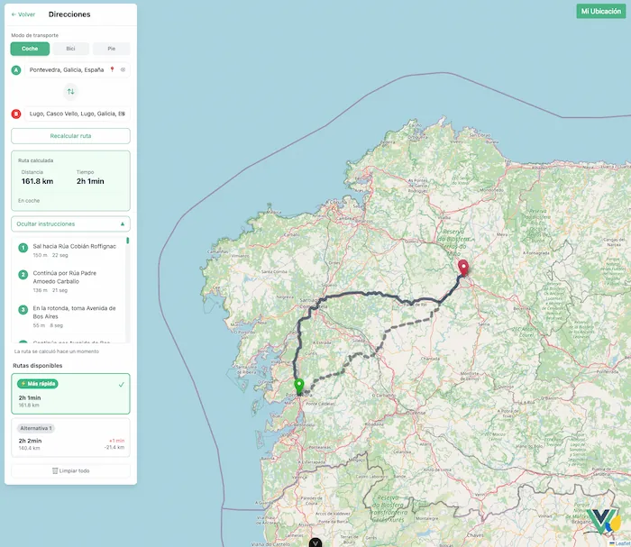

# MapApp - Proyecto de Aprendizaje Vue.js


[](https://vuejs.org/)
[](https://www.typescriptlang.org/)
[](https://vitejs.dev/)
[](https://pinia.vuejs.org/)
[](https://tailwindcss.com/)
[](https://leafletjs.com/)
[](https://nodejs.org/)



<a href="https://vueflet-map-app.vercel.app/">DEMO Link</a>

> **Proyecto educativo** para consolidar conocimientos en Vue 3, Pinia y desarrollo de aplicaciones web modernas.


## 📋 Sobre el Proyecto

Esta aplicación de mapas es un **proyecto de aprendizaje personal**. El objetivo principal es **practicar y asentar conceptos fundamentales** de Vue 3 y Pinia, aplicándolos en un proyecto real y funcional.

### 🎯 Objetivos de Aprendizaje
-  Dominar la Composition API de Vue 3
- Gestionar estado global con Pinia
- Integrar mapas interactivos con Leaflet
-  Consumir APIs externas (Nominatim, OSRM)
-  Implementar TypeScript en Vue
-  Crear componentes reutilizables
-  Manejar navegación y routing

## 🚀 Tecnologías Utilizadas

### Core Framework
- **Vue 3** - Framework progresivo con Composition API
- **TypeScript** - Tipado estático para mejor desarrollo
- **Vite** - Build tool ultrarrápido

### State Management
- **Pinia** - Store moderno y intuitivo para Vue

### Mapas y APIs
- **Leaflet** - Librería de mapas open source
- **OpenStreetMap** - Datos cartográficos gratuitos
- **Nominatim** - Geocoding y búsqueda de lugares
- **OSRM** - Cálculo de rutas

### UI y Estilos
- **Tailwind CSS** - Framework CSS utility-first

## ✨ Características

###  Funcionalidades del Mapa
- **Ubicación actual** del usuario con geolocalización
- **Búsqueda de lugares** en tiempo real
- **Cálculo de rutas** entre dos puntos
- **Múltiples modos de transporte** (coche, bici, caminar)
- **Marcadores interactivos** con información detallada

###  Interfaz de Usuario
- **Modo búsqueda** y **modo direcciones**
- **Componentes reutilizables** y modulares
- **Animaciones suaves** y transiciones
- **Accesibilidad** con roles ARIA

###  Arquitectura
- **Estructura modular** por funcionalidades
- **Stores organizados** con Pinia
- **Interfaces TypeScript** bien tipadas
- **Separación clara** de responsabilidades

## 🛠️ Instalación y Ejecución

### Prerrequisitos
- Node.js (versión 16 o superior)
- npm o pnpm

### Instalación
```bash
# Clonar el repositorio
git clone <url-del-repo>

# Instalar dependencias
npm install
# o
pnpm install
```

### Ejecución en desarrollo
```bash
# Iniciar servidor de desarrollo
npm run dev
# o
pnpm dev
```

### Build para producción
```bash
# Generar build optimizado
npm run build
# o
pnpm build
```

## 📁 Estructura del Proyecto

```
src/
├── modules/
│   ├── common/           # Componentes compartidos
│   │   ├── components/   # ScreenLoader
│   │   └── layouts/      # MainLayout
│   └── map/              # Módulo principal de mapas
│       ├── components/   # Map, MarkerPopup
│       ├── interfaces/   # Tipos TypeScript
│       ├── services/     # Lógica de APIs
│       ├── stores/       # Estado con Pinia
│       └── views/        # Vistas principales
├── router/               # Configuración de rutas
└── assets/               # Recursos estáticos
```

## 🎓 Aprendizajes Obtenidos

Durante el desarrollo de este proyecto, consolidé conocimientos en:

- **Vue 3 Composition API**: `ref`, `computed`, `onMounted`, etc.
- **Pinia Stores**: Gestión de estado global y comunicación entre componentes
- **TypeScript en Vue**: Interfaces, tipos y mejor desarrollo
- **Integración de APIs**: Fetch, async/await, manejo de errores
- **Componentes modulares**: Props, emits, slots


## 📝 Notas del Desarrollador

Este proyecto refleja mi **progreso en el aprendizaje de Vue.js**. Cada commit representa una lección aprendida, un bug solucionado o una mejora implementada. El código está **documentado exhaustivamente** para facilitar el entendimiento y servir como referencia futura.

---

**Hecho durante mi viaje con Vue.js**
